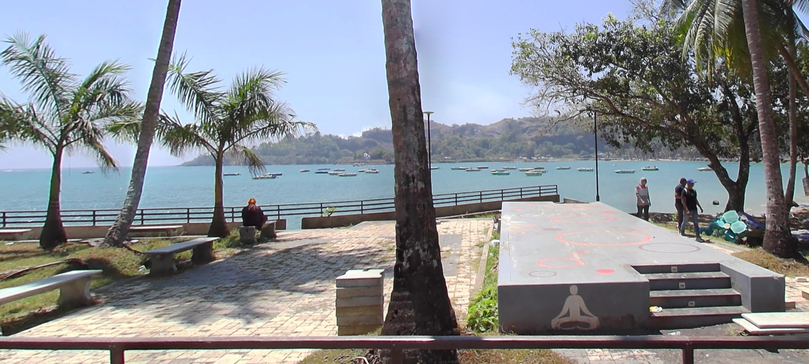
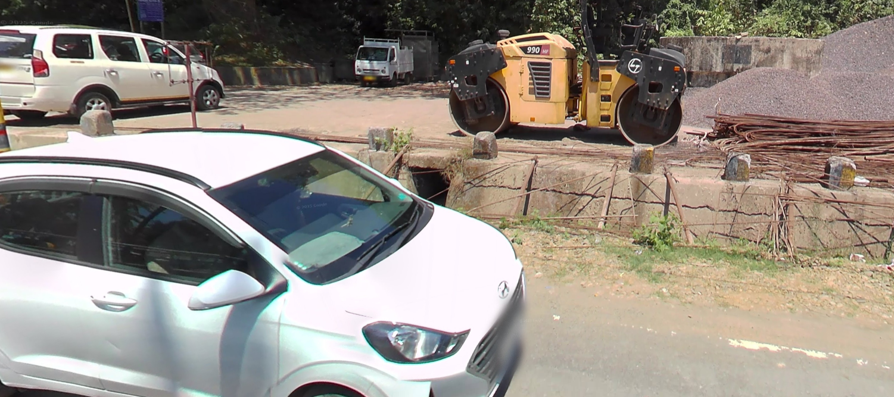
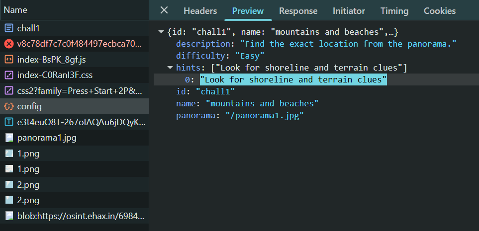

# mountains and beaches

| Field      | Value |
|------------|-------|
| Category   | OSINT |
| Points     | 50 |
| Solves     | 161 |

## Description

https://osint.ehax.in/

From here choose challenge - `mountains and beaches`

## Writeup

On initially seeing the challenge, you will see a 3D view of a beach road with palm trees, some cars(Hyundai), a yoga spot and an L&T roller. This leads to the fact that the location is most likely on the Indian coast.




Also if you inspect network requests, you will find the hint for the challenge - "Look for shoreline and terrain clues"



On doing a quick google search of the image, you will find that the location is in Corbyn's Cove Beach(JPWX+27M, Sri Vijaya Puram, Andaman and Nicobar Islands 744112). From here, pin the location on a map and find the flag.

### Flag

```
EH4X{b34ch35_4nd_5tr4wb3rry5_15_th3_b35t_c0mb0}
```